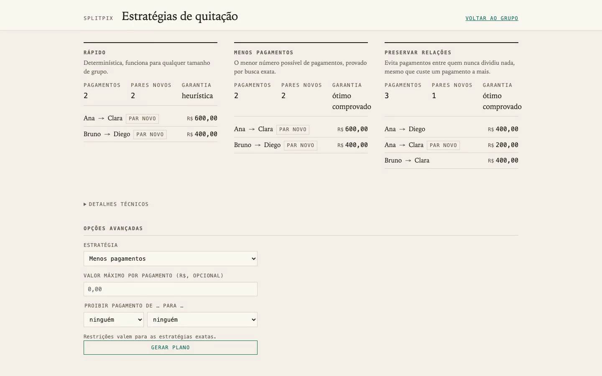

# SplitPix

[](https://github.com/la-38606/splitpix/actions/workflows/ci.yml)

SplitPix is a shared-expense ledger that treats settling up as an
optimization problem. Underneath, balances derive from an append-only ledger
and every financial invariant survives concurrent writes and retries. On
top sits the part that makes the project worth reading: several different
repayment plans can settle the same group, and SplitPix computes them under
selectable objectives (fewest transfers, or fewest new payment
relationships, or a fast heuristic), labeling each with what it does and
does not guarantee. Java 21, Spring Boot, PostgreSQL, hand-written SQL.
**It does not move money.** Plans carry each recipient's Pix key; transfers
happen in the payer's bank app.

<p>
  
  
</p>

## Demo

One minute of the real application on synthetic data: expenses, balances, a
suggested plan, the statement behind a balance, three strategies disagreeing
about the same balances, and a payment recorded over Pix.

[](docs/demo/splitpix-demo.mp4)

Regenerate locally:

```bash
./scripts/record-demo.sh
```

## Why build another expense splitter?

Splitting one bill is arithmetic. Keeping a month of shared expenses correct
is a small distributed-systems problem wearing a consumer UI: requests get
retried, two people hit save at the same moment, and last week's typo needs
a correction that doesn't rewrite history. Solve all of that and a second
problem is still standing. Who should actually pay whom?

The balances alone don't decide it. Take five people after a trip, with net
positions +500, +400, −400, −300, −200 (the `--tecnico` act of the demo
builds this exact group):

| Strategy | Payments | New payment pairs | Guarantee |
|---|---|---|---|
| Fast (greedy) | 4 | 3 | none |
| Fewest payments | 3 | 0 | provably minimal |
| Prefer existing relationships | 3 | 0 | provably minimal for that objective |

All three plans zero every balance to the centavo. What differs is the shape
of the settlement graph. The greedy plan asks Elisa to pay Bruno, two people
who never shared an expense; three transfers settle the same group along the
lines the expenses already drew. The objectives can genuinely conflict, too:
on other balance vectors the relationship-aware plan spends an extra payment
to avoid creating a single awkward pair, and whether that trade is worth it
depends on the group, so SplitPix puts the labeled options in front of the
people involved instead of hardcoding a winner. That choice is the
project's center of gravity.

Pix is its last mile, and that part is personal: I'm Brazilian, and SplitPix
is built for the groups I actually split bills with, which means people who
settle up over Pix and speak Portuguese. So the optimizer decides who should
pay whom, every instruction ends in a copyable Pix key that takes seconds in
any Brazilian bank app, and the interface is in pt-BR because that is who it
serves. The accounting is the part worth building software for precisely
because, where I'm from, the transfer itself is already instant and free.

## How it works

```
expenses (append-only ledger) → derived balances → settlement optimizer → Pix payment instructions
```

Balances are never stored. Every read derives them from a four-leg aggregate
over expenses paid, shares assigned, settlements sent and received; "balances
sum to zero" is a property of the query. Writes serialize per group on a
`SELECT ... FOR UPDATE` of the group row, which is why two concurrent
settlements can never jointly overpay a debt. Idempotency keys plus a SHA-256
request hash make retries safe: same content replays byte-identically, a
back-button edit surfaces as a 409. Composite foreign keys mean a row
physically cannot reference a participant from another group.

The optimizer is a separate pure layer. Both exact strategies run one
memoized search over basic plans; tests cross-check it against a closed-form
bound and against exhaustive enumeration, and a production invariant checker
re-applies every plan before it leaves the service. Past ten nonzero
balances (eight when a per-transfer cap is set) the exact strategies answer
400 instead of quietly handing back a heuristic — both limits came out of
benchmarking, with a deterministic search budget behind them. Requests can
also carry constraints: forbid a payer→recipient pair, or cap the size of
any single transfer, and when nothing satisfies them the answer is a 409
`NO_FEASIBLE_SETTLEMENT_PLAN`. Algorithms, proofs and worked examples:
[docs/design.md §10](docs/design.md).

## Explainable, on demand

The interface stays plain: balances, suggested payments, Pix keys, history.
Every deeper claim sits one click away, and nothing technical is forced on
anyone. "Por quê?" beside a balance opens a statement of the exact ledger
entries behind it; the service sums those entries at request time and
refuses to serve a statement that fails to reconcile with the balance
aggregate. "Por que este plano?" names the strategy in use and its
guarantee. A comparison page shows all strategies side by side, with an
advanced form for constraints:


## Run it

Needs Java 21 and Docker (plus `jq` or `python3` for the demo).

```bash
./mvnw spring-boot:test-run   # app on :8080, throwaway Postgres via Testcontainers
./demo.sh                     # second terminal: the consumer story, pt-BR
./demo.sh --tecnico           # adds strategy comparison, constraints, infeasibility
```

The browser UI is at http://localhost:8080. `./mvnw verify` runs the 203-test
suite; every test that touches persistence runs against real PostgreSQL, and
the optimizer is additionally validated by seeded property tests against two
independent brute-force oracles. Full API with curl examples:
[docs/api.md](docs/api.md). Decisions and their rejected alternatives:
[docs/adr/](docs/adr/). Printable design document:
[docs/splitpix-design-doc.pdf](docs/splitpix-design-doc.pdf).

## Scope and privacy

This is a portfolio project, not a payment service. Nothing here executes or
verifies a transfer; marking a payment complete is a claim by the person who
made it, and every demo runs on synthetic identities.

One privacy decision deserves spelling out. Pix accepts the CPF, Brazil's
national taxpayer number, as a key type. The CPF is a lifelong identifier
tied to bank accounts, credit history and tax filings, and it qualifies as
personal data under the LGPD (Lei 13.709/2018, Brazil's data protection
law), so whoever stores it takes on controller obligations around purpose,
retention and disclosure. A system whose entire access model is a shareable
invite link, where everyone in the group can read every stored key, has no
business holding a national ID. The CPF key type therefore does not exist
here, and the format validation even catches a CPF smuggled in as a RANDOM
key: an EVP key is a UUID, so bare digits never match
([ADR 0004](docs/adr/0004-no-cpf-pix-keys.md)). Email and phone keys are
accepted; every value in the demos is fictional.

## Limitations

- A group is its invite link. Anyone holding it can read and write
  everything, stored Pix keys included. No accounts in v1.
- Append-only means append-only: amounts get corrected with compensating
  entries, and a mistyped Pix key stays wrong.
- Exact optimization stops at ten nonzero balances (eight with a cap). Larger
  groups fall back to the greedy plan by default, and get a 400 if they ask
  for an exact strategy outright.

MIT license.
