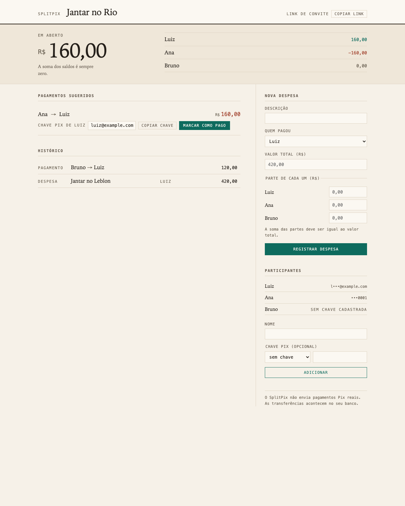
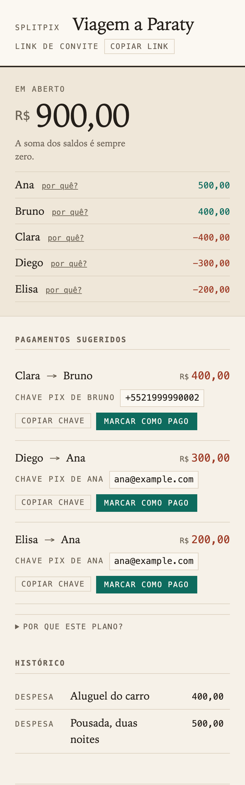
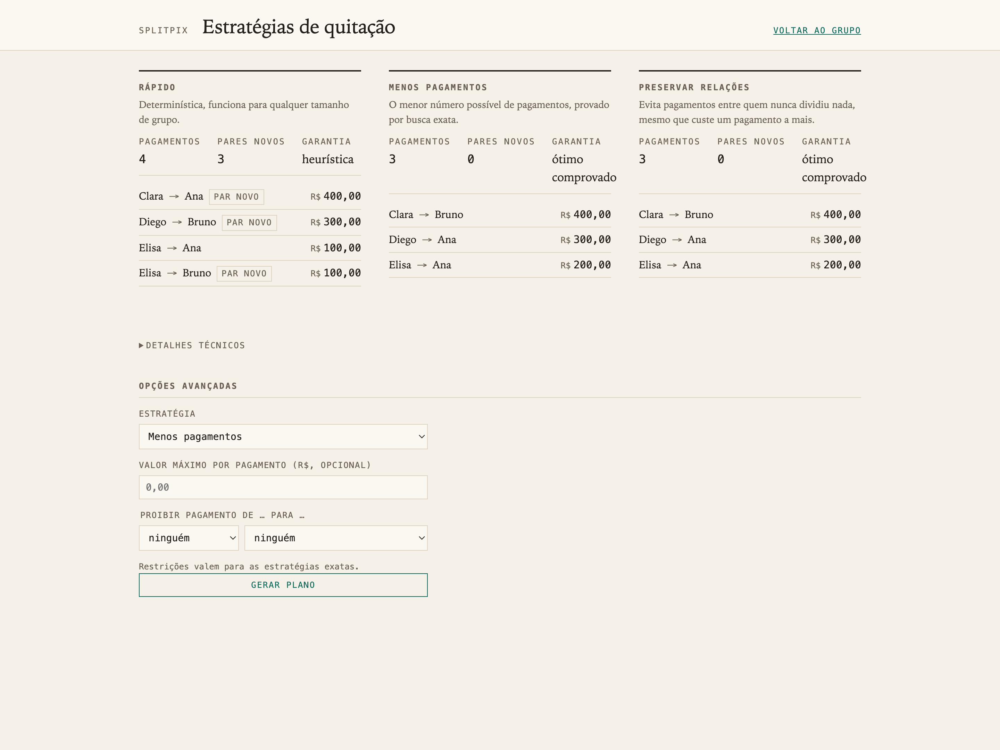

# SplitPix

[](https://github.com/la-38606/splitpix/actions/workflows/ci.yml)

SplitPix is a shared-expense ledger that treats settling up as an
optimization problem. Balances derive from an append-only ledger, financial
invariants hold under concurrent writes and retries, and the repayment plan
is a choice: fewest payments, fewest new payment relationships, or a fast
heuristic, each labeled with what it guarantees. Java 21, Spring Boot,
PostgreSQL, hand-written SQL. **It does not move money.** Plans carry each
recipient's Pix key; transfers happen in the payer's bank app.

<p>
  
  
</p>

## Why build another expense splitter?

Splitting one bill is arithmetic. A shared ledger is harder: it has to stay
correct through retried requests, concurrent writes, and corrections, which
is a small distributed-systems problem wearing a consumer UI. Then comes a
question most tools never surface. Once balances exist, who should pay whom?

Many different transfer graphs settle the same balances exactly. Take five
people after a trip, with net positions +500, +400, −400, −300, −200 (the
`--tecnico` act of the demo builds this group):

| Strategy | Payments | New payment pairs | Guarantee |
|---|---|---|---|
| Fast (greedy) | 4 | 3 | none |
| Fewest payments | 3 | 0 | provably minimal |
| Prefer existing relationships | 3 | 0 | provably minimal for that objective |

The greedy plan routes money between people who never shared an expense.
Three transfers settle the same group along the lines the expenses already
drew. Neither answer is more correct than the other in general; they optimize
different things, and sometimes the relationship-aware plan spends an extra
payment to avoid one awkward new pair. SplitPix computes the options, proves
what can be proven, and lets the group decide. That decision is the project's
center of gravity; the Pix branding is context (in Brazil the transfer itself
is instant and free, so accounting is the only remaining friction).

## How it works

```
expenses (append-only ledger) → derived balances → settlement optimizer → payment instructions
```

Balances are never stored. Every read derives them from a four-leg aggregate
over expenses paid, shares assigned, settlements sent and received; "balances
sum to zero" is a property of the query. Writes serialize per group on a
`SELECT ... FOR UPDATE` of the group row, which is why two concurrent
settlements can never jointly overpay a debt. Idempotency keys plus a SHA-256
request hash make retries safe: same content replays byte-identically, a
back-button edit surfaces as a 409. Composite foreign keys mean a row
physically cannot reference a participant from another group.

The optimizer is a separate pure layer. The exact strategies share one
memoized search over basic plans, cross-checked in tests against a
closed-form bound and against exhaustive enumeration, and every plan passes a
production invariant checker before it leaves the service (applying it must
zero every balance to the centavo). Exact search is refused past ten nonzero
balances rather than silently degraded; the thresholds are measured, not
guessed. Constraints are first-class: forbid a payer→recipient pair, cap the
size of any single transfer, and get 409 `NO_FEASIBLE_SETTLEMENT_PLAN` when
no plan satisfies them. Algorithms, proofs and worked examples:
[docs/design.md §10](docs/design.md).

## Explainable, on demand

The interface stays plain: balances, suggested payments, Pix keys, history.
Every deeper claim is one click away and nothing technical is forced on
anyone. "Por quê?" beside a balance opens a statement of the exact ledger
entries behind it, and the service verifies at runtime that the entries sum
to the balance; a statement that does not reconcile is a 500, not a display.
"Por que este plano?" names the strategy and its guarantee. A comparison page
shows all strategies side by side with an advanced form for constraints:



## Run it

Needs Java 21 and Docker (plus `jq` or `python3` for the demo).

```bash
./mvnw spring-boot:test-run   # app on :8080, throwaway Postgres via Testcontainers
./demo.sh                     # second terminal: the consumer story, pt-BR
./demo.sh --tecnico           # adds strategy comparison, constraints, infeasibility
```

The browser UI is at http://localhost:8080. `./mvnw verify` runs the 203-test
suite; every test that touches persistence runs against real PostgreSQL, and
the optimizer is additionally validated by seeded property tests against two
independent brute-force oracles. Full API with curl examples:
[docs/api.md](docs/api.md). Decisions and their rejected alternatives:
[docs/adr/](docs/adr/). Printable design document:
[docs/splitpix-design-doc.pdf](docs/splitpix-design-doc.pdf).

## The hardest problem

The subtlest defect was a concurrency test that proved nothing. Two
settlement threads released by a barrier looked like proof that the group
lock worked. Then the lock was deleted, and the test kept passing: in a warm
JVM the first transaction commits before the second ever reaches the
database. The replacement holds the lock open inside a paused transaction and
checks that a second request is still stuck waiting; a companion race runs
two settlements that are each valid alone but overpay together. Delete the
lock now and the suite fails, every run. The same standard shaped the
optimizer tests: an exact claim counts only when an independent oracle can
falsify it.

## Scope and privacy

This is a portfolio project, not a payment service. Nothing here executes or
verifies a transfer; marking a payment complete is a claim by the person who
made it. Everything runs on synthetic identities: no CPF is ever stored (the
national ID doubles as a Pix key type, and everyone in a group can read
stored keys, so that key type deliberately does not exist here —
[ADR 0004](docs/adr/0004-no-cpf-pix-keys.md)).

## Limitations

- A group is its invite link. Anyone holding it can read and write
  everything, stored Pix keys included. No accounts in v1.
- Append-only means append-only: amounts get corrected with compensating
  entries, and a mistyped Pix key stays wrong.
- Exact optimization stops at ten nonzero balances (eight with a cap); larger
  groups get the greedy strategy, clearly labeled as such.

MIT license.
