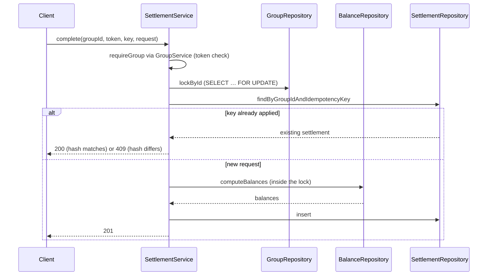

# SplitPix — System Design Reference

**Version:** 3.0 · **Date:** 2026-08-01 · **Status:** current
**Scope:** the design of the SplitPix group-expense service as implemented — components, boundaries, invariants, and the reasoning behind each load-bearing decision.

This document supersedes `splitpix_design_doc_v2.pdf` (v2.1, a pre-implementation plan) and the v2.2 hosting/UI addendum, whose still-relevant content is folded in. Where the earlier documents conflict with the code, the code wins and the conflict is corrected here.

---

## Table of contents

1. [Purpose and scope](#1-purpose-and-scope)
2. [Design goals and constraints](#2-design-goals-and-constraints)
3. [System overview](#3-system-overview)
4. [Architectural decisions](#4-architectural-decisions)
5. [File and directory organization](#5-file-and-directory-organization)
6. [Core types and classes](#6-core-types-and-classes)
7. [Interfaces and boundaries](#7-interfaces-and-boundaries)
8. [Invariants and assumptions](#8-invariants-and-assumptions)
9. [Known gaps and future work](#9-known-gaps-and-future-work)
- [Appendix A: glossary](#appendix-a-glossary)

---

## 1. Purpose and scope

### 1.1 The problem

A group shares costs: one person pays for dinner, another buys groceries, a third covers the taxi. Settling up by hand means reconstructing who paid what, computing each person's net position, and agreeing on who transfers money to whom. In Brazil the transfer itself is easy — Pix is instant and free — so the friction is entirely in the accounting and the coordination, not the payment.

SplitPix records the shared expenses, derives each participant's net balance, reduces the resulting web of debts to a small set of transfers, and tracks which of those transfers have been completed. It produces, for each debtor, a recipient, an exact amount, and the recipient's Pix key.

### 1.2 What operates it

A single Spring Boot application process plus one PostgreSQL database. There is no scheduler, no queue, no background worker, and no second service. A group is created by one person, who shares an invite link; everyone holding that link operates on the same group through either the REST API or the browser UI.

### 1.3 What it produces

- Net balances per participant, derived on demand (§4.3).
- A minimized list of suggested payments, generated on demand and never stored (§4.6).
- An append-only record of expenses and completed settlements.

### 1.4 Explicitly out of scope

SplitPix **does not move money**. It initiates no Pix transfer, holds no bank credentials, integrates with no financial institution, and cannot verify that a payment occurred — marking a settlement complete is a human assertion. Also out of scope: user accounts and authentication (§4.7), multi-currency, interest or fees, expense editing or deletion (§4.8), participant removal, and public group discovery.

---

## 2. Design goals and constraints

Ranked. Each subsequent decision in §4 traces to a goal here; where two goals conflict, the higher-ranked one wins.

**G1. Accounting correctness is non-negotiable.** Money must never be created or destroyed by the system. The sum of a group's balances is zero at every observable moment, and no sequence of concurrent requests may produce a state where someone has paid more than they owed. This goal outranks throughput, latency, and feature count, and it is the reason for §4.2 (group-level locking), §4.3 (derived balances), and §4.4 (integer money).

**G2. Correctness must be demonstrable, not merely asserted.** A design that is correct but unprovable is treated as unfinished. This drives invariant-based testing against real PostgreSQL rather than mocks, the deterministic lock tests in §7.4, and the decision to keep the concurrency model simple enough to reason about exhaustively (§4.2).

**G3. Retries must be safe.** Clients time out and users press buttons twice; neither may create duplicate financial records, and neither may silently discard data the user believes was saved. This drives §4.5 (idempotency with request hashing).

**G4. The database is a participant in correctness, not a passive store.** Every application-level rule that can be expressed as a constraint is also expressed as a constraint, so a service-layer bug degrades to a rejected write rather than corrupt accounting (§4.9).

**G5. Explicitness over convenience.** SQL is written, not generated; transaction boundaries and locks are visible in the code that depends on them. Accepted cost: more mapping code (§4.10).

**Accepted costs.** Throughput within a single group is deliberately sacrificed (§4.2). Balance reads are recomputed rather than cached (§4.3). The access model is weak by construction (§4.7). These are consequences of the ranking above, not oversights.

---

## 3. System overview

### 3.1 Components

| Component | Responsibility |
|---|---|
| REST controllers (`*Controller` in feature packages) | Parse and shape-validate HTTP requests, delegate, map results to JSON |
| Page controller (`GroupPageController`) | Same, for server-rendered HTML; holds no business logic |
| Services (`*Service`) | Business rules, transaction boundaries, locking, idempotency |
| Repositories (`*Repository`) | SQL execution, row mapping, explicit row locking |
| `DebtSimplifier` | Pure function: balances in, transfers out; no Spring, no I/O |
| Error advices (`GlobalExceptionHandler`, `PageExceptionHandler`) | Exception → status code + `{code, message}` or HTML |
| PostgreSQL | Durable state, constraint enforcement, write serialization |

### 3.2 Data flow: completing a settlement, end to end

The settlement path exercises every mechanism in the system. `SettlementController.complete` receives `POST /api/v1/groups/{groupId}/settlements?token=…` with an `Idempotency-Key` header and a `CompleteSettlementRequest` body, and calls `SettlementService.complete`, which is annotated `@Transactional`. Inside that transaction:

1. `GroupService.requireGroup` loads the group and compares the supplied token to the stored one with `MessageDigest.isEqual`; a mismatch throws `ForbiddenException`.
2. `IdempotencyKeys.validate` rejects a blank or over-long key.
3. `RequestHashes.of` computes a SHA-256 over payer, recipient and amount.
4. `GroupRepository.lockById` executes `SELECT id FROM groups WHERE id = ? FOR UPDATE`. From here until commit, no other expense or settlement in this group can proceed (§4.2).
5. `SettlementRepository.findByGroupIdAndIdempotencyKey` looks for a prior application of this key. If found with the same hash, the stored settlement is returned and the request ends (HTTP 200); if found with a different hash, `ConflictException("IDEMPOTENCY_CONFLICT")` (§4.5).
6. Amount and participant-distinctness are validated.
7. `BalanceRepository.computeBalances` recomputes every balance in the group **inside the lock** — this is what makes the following check sound.
8. The payer must owe at least the amount and the recipient must be owed at least the amount, or `ConflictException("SETTLEMENT_EXCEEDS_DEBT")`.
9. `SettlementRepository.insert` writes the row and returns the database-assigned `created_at`.
10. Commit releases the lock.

Any exception unwinds the whole transaction, so a failure between steps 9 and 10 leaves no row (§8, I7).



### 3.3 Read path

Reads take no lock. `GET /balances` runs the single aggregate of §4.3; `GET /suggested-payments` runs that aggregate and feeds the result to `DebtSimplifier.simplify`; `GET /activity` runs one `UNION ALL` over expenses and settlements. Balances and activity are single statements and therefore internally consistent by construction; the suggested-payments path adds a second read for the recipients' Pix keys, whose only failure mode is a missing key rendered as absent.

---

## 4. Architectural decisions

### 4.1 Module boundary scheme: feature packages over layer packages

**Context.** The system has six domain concepts (group, participant, expense, balance, settlement, activity) and three layers (controller, service, repository).

**Decision.** Packages are named for features; layers are expressed by class-name suffix within a package. `common` holds cross-cutting concerns (error contract, shared validators); `web` holds the browser UI.

**Alternatives rejected.** Layer-first packaging (`controllers/`, `services/`, `repositories/`) was rejected because every change to a feature would touch three distant directories, and because it provides no encapsulation boundary — everything is public to everything. A hexagonal/ports-and-adapters arrangement was rejected as disproportionate: there is exactly one inbound adapter family (HTTP) and one outbound (JDBC), so the indirection would buy nothing.

**Consequences.** A contributor adding a feature creates one package (§5). The cost is that cross-feature reuse is by direct dependency — `ExpenseService` imports `GroupRepository` and `ParticipantRepository` — so package dependencies form a graph rather than a strict hierarchy. The graph contains one deliberate cycle: `group` and `participant` depend on each other (`GroupService` inserts the creator participant; `ParticipantService` uses the group's token check and lock), reflecting that a group cannot exist without its creator. `common` is a sink — it imports nothing from the application.

### 4.2 Concurrency: one lock per group, held by every write

**Context.** Balances are derived from expenses, expense shares, and settlements (§4.3). A settlement is only valid relative to the balances at the moment it commits (G1). Under PostgreSQL's default `READ COMMITTED`, a transaction that validates against a snapshot can be invalidated by a concurrent commit before it inserts.

**Decision.** Every write path — `GroupService.create` excepted, since the group does not yet exist — acquires `SELECT id FROM groups WHERE id = ? FOR UPDATE` via `GroupRepository.lockById` before reading anything it will validate against: `ExpenseService.create`, `SettlementService.complete`, and `ParticipantService.add`. Reads take no lock.

**Alternatives rejected.**

- *Locking the participant rows involved.* Rejected because it is unsound: an expense insert changes balances without touching any participant row, so a concurrent expense could commit between a settlement's validation and its insert, breaking invariants I4 and I5 (§8). This is the central concurrency argument of the system.
- *`SERIALIZABLE` isolation.* Rejected because it converts the failure mode into serialization errors that every caller must be prepared to retry, and because the group lock already makes `READ COMMITTED` sufficient — all validation happens after the lock is held and inside the same transaction.
- *Optimistic concurrency with a version column on the group.* Rejected as equivalent in throughput to the pessimistic lock for this workload while adding a retry path to test and reason about (G2).

**Consequences.** All writes within one group serialize. For a five-person dinner this is irrelevant; for a hypothetical thousand-member group it would be a bottleneck. The benefit is that invariants I4, I5 and I8 (§8) have one-paragraph proofs. Note that `ParticipantService.add` takes the lock for explicitness: its inserts were already serialized against other writers as a side effect of the `group_id` foreign key taking `FOR KEY SHARE` on the group row, but that is an invisible property that a schema change could silently remove.

**Deadlock analysis.** The only conflicting lock mode taken by application code is `FOR UPDATE` on a `groups` row, and every path takes it before any insert. All participant-row locks are the `FOR KEY SHARE` locks that foreign-key checks acquire, which are mutually compatible. No lock-order cycle is constructible.

### 4.3 Balances are derived, never stored

**Context.** Every operation needs current balances; a settlement needs them to be correct.

**Decision.** No balance column exists. `BalanceRepository.computeBalances` runs one aggregate with four `UNION ALL` legs — expenses paid (+), expense shares assigned (−), settlements sent (+), settlements received (−) — left-joined onto `participants` so a participant with no activity yields zero via `COALESCE`.

**Alternatives rejected.** A stored balance updated on each write was rejected because it introduces a second source of truth that can drift from the ledger, and drift in an accounting system is the failure mode with the worst blast radius (G1). A materialized view was rejected because it must be refreshed, which reintroduces staleness inside the settlement transaction, where staleness is precisely what must not happen.

**Consequences.** Balance reads cost a scan of the group's expenses, shares and settlements — acceptable at the intended scale, and the composite unique constraints provide usable indexes. The zero-sum invariant (I1) becomes a property of the query rather than something application code must maintain. The upper bound on amounts (§4.4) exists partly to keep this aggregate representable.

### 4.4 Money as integer centavos with an explicit cap

**Decision.** All monetary values are `long` in Java and `BIGINT` in PostgreSQL, denominated in centavos. Floating-point types never touch a monetary value: `spring.jackson.deserialization.accept-float-as-int=false` makes a fractional JSON amount a 400 rather than a silent truncation. `Money.MAX_AMOUNT_CENTS` caps any single amount at 10¹² centavos, enforced in services and by CHECK constraints.

**Alternatives rejected.** `BigDecimal` was rejected as unnecessary — with a fixed currency and no fractional centavos, integers are exact and cheaper. Unbounded `BIGINT` was rejected after a demonstrated failure: `SUM(bigint)` returns `numeric` in PostgreSQL, which does not overflow, so two `Long.MAX_VALUE` expenses produced an aggregate that `ResultSet.getLong` could not read, permanently breaking every balance read for that group.

**Consequences.** A group cannot record an expense above R$ 10 billion. The cap must stay consistent between `Money.MAX_AMOUNT_CENTS` and the schema CHECKs; they are separate declarations of the same number (§8, A3).

### 4.5 Idempotency: key plus request hash

**Context.** Clients retry after timeouts (G3); browsers resubmit forms and offer a back button.

**Decision.** Expense and settlement creation require an `Idempotency-Key`, unique per group by constraint. Each row also stores `request_hash`, a SHA-256 over the semantic content of the request (for expenses: description, payer, total, and shares sorted by participant id, so ordering is not significant). On replay: same key and same hash returns the stored record with HTTP 200; same key and different hash returns 409 `IDEMPOTENCY_CONFLICT`.

**Alternatives rejected.** Key-only idempotency — the earlier design — was rejected once the browser UI existed: editing a form after submission and resubmitting reuses the key with different content, and returning the original record reports success while discarding the user's correction. Silent data loss is worse than a conflict the user can act on. Hashing the raw request bytes was rejected because whitespace or share ordering would produce spurious conflicts.

**Consequences.** The hash must cover exactly the fields that change meaning; a field added to a request record without being added to the hash creates a silent hole (§8, A4). In the browser, every form POST additionally follows Post/Redirect/Get, so a refresh re-issues a GET rather than a write; the idempotency key handles the retry and back-button cases PRG cannot.

### 4.6 Repayment simplification: greedy, on demand, never stored

**Decision.** `DebtSimplifier.simplify` repeatedly matches the largest debtor with the largest creditor using two priority queues, transferring the smaller of the two magnitudes. Suggestions are computed per request and never persisted.

**Alternatives rejected.** Exact minimization of the transfer count is NP-hard; the greedy algorithm guarantees at most n−1 transfers, which is already small for real groups. Storing suggestions as obligations was rejected because any new expense invalidates them, and stale stored obligations would then need invalidation logic — complexity that on-demand generation removes entirely.

**Consequences.** Suggested payments have no identity, so completing one requires the client to submit payer, recipient and amount. A suggestion can go stale between render and submission; the settlement path re-validates and rejects with 409 rather than trusting the client. Tie-breaking is by participant id so output is deterministic for a given input (§7.3).

### 4.7 Access control: invite token, not authentication

**Decision.** A group is reachable by a 256-bit `SecureRandom` token, base64url-encoded, compared in constant time. The REST API takes it as a `?token=` query parameter; the browser UI exchanges it once for an `HttpOnly`, `SameSite=Lax` cookie scoped to `/g/{groupId}` and then uses token-free URLs.

**Alternatives rejected.** User accounts with passwords or OAuth were rejected as disproportionate for the MVP: they multiply scope (registration, recovery, sessions, per-participant authorization) without exercising the accounting core this system exists to demonstrate. Keeping the token in the URL for the browser was rejected because it lands in history, `Referer` headers, platform access logs, and chat-app link-preview fetches.

**Consequences.** Anyone with the link has full read and write access to that group, including other participants' Pix keys. There is no identity, so the system cannot attribute an action to a person or authorize per participant. `SameSite=Lax` is the only CSRF defense; that is sufficient only because the cookie is the sole credential and there is no other session state.

### 4.8 Append-only accounting

**Decision.** Expenses and settlements are never updated or deleted. Corrections are made by recording an opposing entry.

**Alternatives rejected.** Editable expenses were rejected because an edit changes historical balances, which can retroactively invalidate settlements that were valid when they were made — the resulting reconciliation problem is larger than the feature is worth here.

**Consequences.** No `PUT`/`PATCH`/`DELETE` exists on accounting rows. A mistaken settlement cannot be reversed by an opposite settlement — invariants I4/I5 reject it, because the erroneous payer no longer owes anything — so the correction is a compensating *expense* (paid by the wrongly-recorded recipient, with the full share assigned to the wrongly-recorded payer), which restores both balances. A participant's Pix key also cannot be edited (§9), which is a real gap rather than a considered decision — it is a consequence of never having built a participant-mutation path.

### 4.9 Errors: stable machine codes, localized messages, database as backstop

**Decision.** Services throw `ApiException` subclasses carrying a stable English code (`BadRequestException`, `ForbiddenException`, `NotFoundException`, `ConflictException`). `GlobalExceptionHandler` maps code → HTTP status and resolves the code to a Brazilian Portuguese message via `MessageSource`; `PageExceptionHandler` does the same for HTML. Message resolution has **no default**, so a missing bundle key fails loudly in tests instead of degrading silently in production. Constraint violations that escape service validation surface as 409 `CONSTRAINT_VIOLATION`, and only the first line of the database message is logged, because PostgreSQL puts the offending values — potentially Pix keys — on the `Detail:` line.

**Alternatives rejected.** HTTP status alone was rejected as too coarse for clients to branch on. Localized text as the contract was rejected because it makes translation a breaking change; tests assert on codes and never on message text.

**Consequences.** Two advices exist. `PageExceptionHandler` is ordered `HIGHEST_PRECEDENCE` and scoped to the `web` package, so page controllers get HTML; everything else, including framework-level errors raised before a controller is selected (405, 415, unknown path), falls through to the JSON advice.

### 4.10 Persistence: JdbcTemplate, no ORM

**Decision.** Plain SQL through `JdbcTemplate`, with `RowMapper`s written by hand.

**Alternatives rejected.** JPA/Hibernate was rejected because the two properties that matter most here — exactly when a lock is taken and exactly what the balance aggregate is — become implicit under an ORM (G5), and because lazy loading and the persistence context introduce failure modes disproportionate to a five-table schema.

**Consequences.** Mapping is manual and adding a column touches the record, the mapper, and the insert. The upside is that every statement the system issues is visible in the repository classes.

### 4.11 Schema application: `schema.sql` at startup

**Decision.** `spring.sql.init.mode=always` applies `schema.sql`, which uses `CREATE TABLE IF NOT EXISTS`.

**Consequences — known defect.** This only ever initializes an *empty* database: against a database created by an earlier revision, constraint and column changes are silently skipped and startup reports success. Verified behavior, not speculation. Test suites are unaffected because Testcontainers provides a fresh database per run. Migration tooling (Flyway) is the fix and is deferred (§9).

### 4.12 External dependencies that would hurt to swap

| Dependency | Why it is load-bearing |
|---|---|
| PostgreSQL | `FOR UPDATE` semantics, deferrable constraints, `UNION ALL` aggregate, and `clock_timestamp()` are all used deliberately; a different engine would require re-verifying §4.2 and §4.3 |
| Testcontainers | G2 depends on tests running against the real engine; substituting an in-memory database would invalidate every constraint and locking test |
| Spring Boot 4.1 / Jackson 3 | Jackson 3 lives under `tools.jackson.*`, and parser limits are configured through `spring.jackson.factory.constraints.read.*` (§4.13) |
| Thymeleaf | UI only; swapping it would not touch the accounting core |

### 4.13 Request-size limits at the parser

**Decision.** `spring.jackson.factory.constraints.read.max-document-length` caps the JSON document, and `CreateExpenseRequest.shares` is bounded by `@Size(max = 500)`.

**Context.** An unbounded `shares` array was demonstrated to exhaust the heap of a 256 MB instance from a handful of concurrent anonymous requests. Bean validation alone is insufficient: it runs *after* Jackson has already materialized the list. The parser-level cap also covers chunked requests, which have no `Content-Length` to inspect.

---

## 5. File and directory organization

```
splitpix/
├── src/main/java/com/luiz/splitpix/
│   ├── SplitpixApplication.java     entry point
│   ├── PingController.java          GET /api/v1/ping health endpoint
│   ├── common/                      cross-cutting; depends on nothing in the app
│   │   ├── ApiException.java + Bad/Forbidden/NotFound/Conflict subclasses
│   │   ├── ErrorResponse.java       the {code, message} wire shape
│   │   ├── GlobalExceptionHandler.java   exception → status + JSON
│   │   ├── IdempotencyKeys.java     key shape validation
│   │   ├── Money.java               MAX_AMOUNT_CENTS
│   │   ├── RequestHashes.java       SHA-256 over request content
│   │   └── Texts.java               name normalization and rejection rules
│   ├── group/                       group creation, invite token, group view
│   ├── participant/                 participants, Pix key types and normalization
│   ├── expense/                     expense creation transaction
│   ├── balance/                     balance aggregate, DebtSimplifier, suggestions
│   ├── settlement/                  settlement transaction
│   ├── activity/                    combined history read
│   └── web/                         server-rendered UI; no business logic
├── src/main/resources/
│   ├── schema.sql                   all tables and constraints (§4.11)
│   ├── messages.properties          every user-facing string, pt-BR
│   ├── application.properties       datasource, Jackson limits, SQL init
│   ├── templates/                   Thymeleaf: home, group, erro
│   └── static/                      splitpix.css, copiar.js
├── src/test/java/com/luiz/splitpix/  mirrors main; see §7.4
├── demo.sh                          end-to-end walk-through against a running instance
└── docs/design.md                   this document
```

**Placement rule for new code.** Code that serves one domain concept goes in that concept's package, named `<Concept>Controller|Service|Repository` or a record for its request/response/result. Code used by two or more feature packages goes in `common` and must not depend on any feature package. Code that exists only to render HTML goes in `web`. A new domain concept gets a new package rather than an addition to an existing one.

**Why `common` is a sink.** It holds the error contract and validators that every feature needs. Keeping its dependency set empty keeps the one existing cycle (`group` ↔ `participant`, §4.1) from spreading: shared utilities can never become a path between features.

**Why `web` is separate from the feature packages.** The UI is a client of the services, exactly as the REST controllers are, and the REST API is the primary interface. Keeping page controllers out of the feature packages makes it structurally obvious that removing the UI would not touch the domain, and lets `PageExceptionHandler` be scoped by package (§4.9).

---

## 6. Core types and classes

### 6.1 `group`

`Group` — a record mirroring the `groups` row: id, name, invite token, creation instant. Constructed only by `GroupRepository`'s mapper. Never mutated; a group's name and token are fixed at creation.

`GroupService` — owns group creation and, critically, `requireGroup(groupId, token)`, the single access check every group-scoped operation calls. It exists as one method so the token comparison has exactly one implementation. `create` is `@Transactional` because it writes two tables (group and creator participant) that must appear together (I7). `getView` returns group plus participants in one read-only transaction so the page and API see one snapshot.

`GroupRepository` — SQL for groups, plus `lockById`, the concurrency primitive of §4.2. `lockById` throws `NotFoundException` when the row is absent rather than returning silently, because a lock that no-ops is worse than one that fails.

`CreateGroupRequest` / `CreateGroupResult` / `GroupView` / `GroupResponse` — request, service result, internal read aggregate, and wire shape respectively.

### 6.2 `participant`

`Participant` — a record mirroring the row, including the optional Pix key type and value. Created by `ParticipantService.add`; never updated (§4.8).

`PixKeyType` — enum of `EMAIL`, `PHONE`, `RANDOM`. CPF is deliberately absent: storing a national identifier behind a link-shared access model is a privacy liability with no upside for this system. The enum's absence of a CPF constant is what makes a CPF request a 400 rather than a stored value.

`PixKeys` — normalization, the paired-nullability rule, and per-type shape validation. Lowercases `EMAIL` and `RANDOM` keys because Pix DICT treats both case-insensitively, so without it two participants could hold the same effective key; re-checks length after normalization because lowercasing can lengthen a string. `validateFormat` requires an email shape for `EMAIL`, E.164 for `PHONE`, and a UUID for `RANDOM` — pragmatic shapes rather than DICT verification, enough to catch a key pasted into the wrong field or a CPF smuggled under `RANDOM` (an EVP key is a UUID, so bare digits never match).

`ParticipantService` — validates, takes the group lock (§4.2), pre-checks duplicate keys for a friendly error, and maps a `DuplicateKeyException` from the losing side of a race to the same `DUPLICATE_PIX_KEY` code so the contract is timing-independent.

### 6.3 `expense`

`Expense` — the row: id, group, payer, description, total, idempotency key, request hash, creation instant. `ExpenseShare` — a participant/amount pair.

`ExpenseService` — the expense creation transaction (§3.2 has the settlement analogue). Validates that the total is positive and capped, that the payer and every share participant belong to the group, that no participant appears twice, that no share is negative, and that shares sum exactly to the total. Returns shares in a canonical order matching the database's ordering so a replay is byte-identical to the original response.

`CreateExpenseRequest` — carries the bean-validation constraints, including the type-argument constraints (`List<@NotNull @Valid ShareRequest>`) that reject null elements, and the size bound of §4.13. Its compact constructor strips the description so validation and storage agree on length.

### 6.4 `balance`

`ParticipantBalance` — participant id, display name, balance in centavos. Produced only by `BalanceRepository`; also the input type of `DebtSimplifier`.

`BalanceRepository` — holds `BALANCES_SQL`, the four-leg aggregate of §4.3. This is the single most correctness-critical statement in the system.

`DebtSimplifier` — a final class with static methods and no Spring dependency, so it is unit-testable without a container. Rejects a non-zero-sum input with `IllegalArgumentException`: that condition indicates the aggregate is broken, and failing loudly is preferable to emitting a payment plan that does not settle.

`SuggestedPayment` — the payment instruction: both parties, the amount, and the recipient's Pix key.

### 6.5 `settlement`

`Settlement` — the row, including `status`, which the schema constrains to `COMPLETED`. The MVP has no pending state because there is no asynchronous payment verification to wait for; a status column exists so that adding one later does not require a migration of meaning.

`SettlementService` — the transaction described in §3.2.

### 6.6 `web`

`GroupPageController` — one controller for all pages; each action is a POST that redirects (§4.5). `GroupPage` — a record assembling everything one render needs, so the template performs no lookups. `InviteCookie` — the token-to-cookie exchange of §4.7. `PageFormats` — a Spring bean (referenced as `@pageFormats` in templates) formatting centavos and masking Pix keys.

### 6.7 Trivial types

`CreateExpenseResult`, `CompleteSettlementResult`, `ExpenseResponse`, `SettlementResponse`, `ParticipantResponse`, `GroupResponse`, `ErrorResponse`, `AddParticipantRequest`, `CompleteSettlementRequest`, `ActivityItem` are records that carry data across a boundary and hold no logic beyond static factory mapping.

---

## 7. Interfaces and boundaries

### 7.1 HTTP → service

Controllers pass primitives and request records; services return domain records. Controllers may assume a service either returns a valid result or throws an `ApiException`; services may assume nothing about the caller and re-validate everything that matters. The boundary protects against a controller — or a future second controller, which is exactly what the UI became — bypassing a rule. This is why `ParticipantService.add` re-checks the token rather than trusting that a controller did.

### 7.2 Service → repository

Repositories expose intent-named methods (`findByGroupIdAndIdempotencyKey`, `lockById`, `computeBalances`) rather than a generic query interface. Services may assume repositories perform no validation and no business decisions; repositories may assume their arguments are already validated. The boundary protects the ability to read every statement the system can issue by opening one file per table.

### 7.3 `DebtSimplifier.simplify(List<ParticipantBalance>) → List<Transfer>`

The strictest contract in the system. Preconditions: the input sums to zero. Postconditions: applying every returned transfer drives all balances to zero; every amount is strictly positive; no transfer has the same participant on both ends; at most n−1 transfers are returned; and output is deterministic for a given input because both queues break ties on participant id. Callers may assume every returned transfer is individually valid under invariants I4 and I5 at the moment of generation — by construction each transfer's amount is at most the smaller of the two residual magnitudes.

### 7.4 Test seams

`ApiTestSupport` is the shared base for API tests; sharing one Spring context and one container across subclasses is deliberate, since each distinct annotation combination forks a new context and a new PostgreSQL container. `@MockitoSpyBean` on a repository is the seam used to force failures that cannot be produced through the API — rollback tests let the real insert execute and then throw, because a test that mocks the insert away would pass without any transaction at all.

`GroupLockTest` deserves mention as a boundary of a different kind: it holds the group lock inside a paused transaction and asserts the second request has not completed, because a barrier-synchronized race passes in a warm test context even with the lock removed.

---

## 8. Invariants and assumptions

Violations here are silent and expensive. Nothing in the type system enforces them.

**I1 — A group's balances sum to zero.** Guaranteed by the aggregate's structure (§4.3) as long as every leg's sign is correct and every referenced participant belongs to the group. *Breaks if:* a leg's sign is flipped, or a row references a participant of another group. The composite foreign keys make the second case impossible at the database level.

**I2 — An expense's shares sum to its total.** Enforced in `ExpenseService.validate` only. The database cannot express it. *Breaks if:* the sum check is removed or bypassed by direct SQL; balances then stop summing to zero.

**I3 — Every accounting row references participants of its own group.** Enforced by composite foreign keys on `(group_id, participant_id)`, which require the `UNIQUE (group_id, id)` constraints on `participants` and `expenses` to exist. *Breaks if:* those unique constraints are dropped — the composite keys become undeclarable and the schema silently loses the guarantee.

**I4/I5 — No over-settlement in either direction.** Enforced in `SettlementService` under the group lock. *Breaks if:* the lock is removed (two individually valid settlements can then jointly over-settle), or either side of the balance check is dropped.

**I6 — One idempotency key produces at most one durable record.** Enforced by the group lock plus `UNIQUE (group_id, idempotency_key)`.

**I7 — A failed transaction leaves no partial state.** Depends on `@Transactional` being present on every multi-statement write and on Spring's proxying applying — a self-invocation would silently bypass it. No such call exists today; `requireGroup` is deliberately unannotated so it joins the caller's transaction.

**I8 — Concurrent settlements cannot over-settle.** A corollary of I4/I5 plus §4.2, and the reason the group lock exists.

**A1 — `clock_timestamp()`, not `now()`, orders the ledger.** `now()` is transaction-start time, but writes serialize at lock-acquisition time, so a transaction that waited would receive a timestamp earlier than writes it depends on, and the activity feed could show a settlement before the expense that created the debt.

**A2 — The database is initialized empty.** See §4.11. A database created by an older revision silently lacks newer constraints.

**A3 — `Money.MAX_AMOUNT_CENTS` and the schema CHECKs state the same number.** Two independent declarations; a change to one without the other produces either a 500 where a 400 belongs, or an uncapped path.

**A4 — `request_hash` covers every field that changes a request's meaning.** A field added to a request record but not to the hash makes two materially different requests interchangeable under one key.

**A5 — Pix key values are never logged.** Enforced by convention plus the first-line truncation in `GlobalExceptionHandler`; PostgreSQL puts values on the `Detail:` line of constraint messages.

**A6 — Every error code emitted has a bundle key.** Message resolution has no default (§4.9), so a missing key is a runtime failure, not a degraded message.

---

## 9. Known gaps and future work

| Gap | Status and reason |
|---|---|
| Schema migrations | `CREATE TABLE IF NOT EXISTS` cannot evolve an existing database (§4.11). Flyway is the intended fix; deferred because every environment so far is disposable. |
| Pix key editing | Not implemented. A key typed incorrectly can never be corrected: a wrong key appears in full on every payment instruction, and a participant with no key appears as a recipient with the key shown as absent. This is the most user-visible gap. Participants are not accounting rows, so append-only (§4.8) does not forbid a mutation path — it was never built. |
| Participant removal | Not implemented; the deferred foreign key on `expense_shares` deliberately makes a raw delete fail rather than silently corrupt balances. |
| Group and participant creation idempotency | The browser forms for creating a group and adding a participant carry no idempotency key, and the corresponding endpoints accept none — a back-button resubmission duplicates the participant (the expense and settlement paths are protected). |
| Rate limiting and abuse controls | Absent. `POST /api/v1/groups` is unauthenticated by design, so a public deployment needs per-IP limits and caps before exposure. |
| Public hosting | Not deployed. Preconditions: migrations, rate limiting, a declared data-retention posture (Pix keys are personal data), and confirmation that no invite token reaches platform access logs. |
| Group-existence oracle | `GET` returns 404 before checking the token, so an unauthenticated caller can distinguish existing from non-existent group ids. Accepted: ids are random UUIDs and existence alone reveals nothing. |
| Unknown-path responses on page routes | A URL matching no controller returns the JSON error contract rather than an HTML page, because advice scoped to a package cannot apply when no controller was selected (§4.9). |
| Observability | Only errors are logged. No request id, no metrics, no per-operation success logging. |
| `PARTICIPANT_NOT_FOUND` | No such code exists; an unknown participant id is reported as 400 `PARTICIPANT_NOT_IN_GROUP`. Recorded because the v2.1 document promised a 404. |

---

## Appendix A: glossary

**Balance** — a participant's net position in centavos: positive means the group owes them, negative means they owe the group. Always derived (§4.3).

**Centavo** — 1/100 of a Brazilian real; the atomic unit of all monetary values here.

**DICT** — the Brazilian Central Bank's directory that maps a Pix key to an account. SplitPix does not query it; it is the reason email keys are treated case-insensitively.

**Group lock** — the `SELECT … FOR UPDATE` on a `groups` row that serializes all writes within one group (§4.2).

**Idempotency key** — a client-supplied identifier, unique per group, that makes a retried write produce at most one record (§4.5).

**Invite token** — the 256-bit secret that grants access to a group; the system's only credential (§4.7).

**Pix** — Brazil's instant payment system. SplitPix coordinates around it but performs no transfers.

**Pix key** — an email address, phone number, or random UUID that identifies a payee in Pix.

**Settlement** — a recorded assertion that one participant paid another; append-only and always `COMPLETED`.

**Share** — the portion of an expense assigned to one participant; shares of an expense sum to its total (I2).

**Suggested payment** — a transfer proposed by `DebtSimplifier`; generated on demand, never stored (§4.6).
